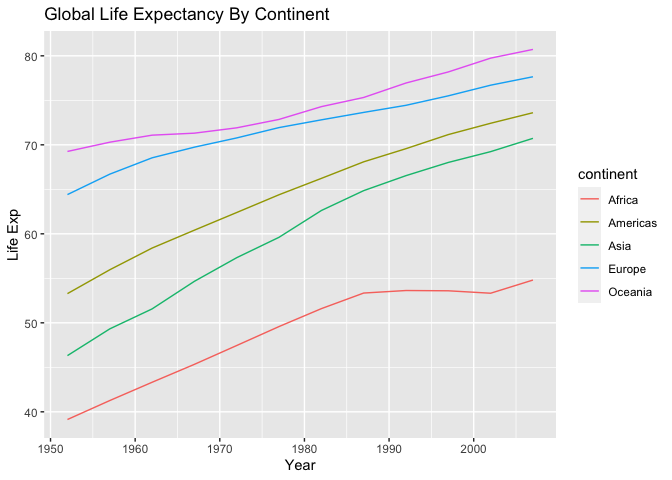
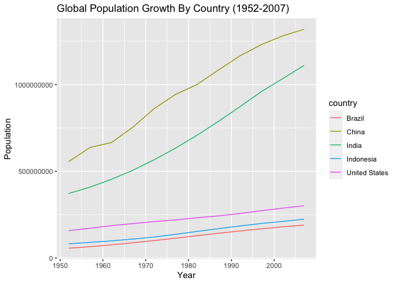
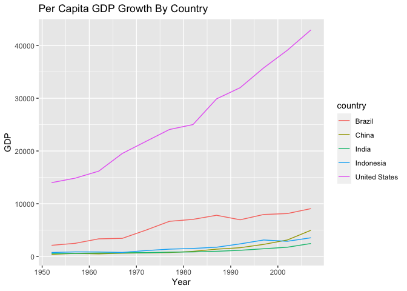

## Instructions
Answer the following questions and complete the exercises in RMarkdown. Please embed all of your code and push your final work to your repository. Your final lab report should be organized, clean, and run free from errors. Remember, you must remove the `#` for the included code chunks to run. Be sure to add your name to the author header above. For any included plots, make sure they are clearly labeled. You are free to use any plot type that you feel best communicates the results of your analysis.  

**In this homework, you should make use of the aesthetics you have learned. It's OK to be flashy!**

Make sure to use the formatting conventions of RMarkdown to make your report neat and clean!  

## Load the libraries

```r
library(tidyverse)
library(janitor)
library(here)
library(naniar)
```

## Resources
The idea for this assignment came from [Rebecca Barter's](http://www.rebeccabarter.com/blog/2017-11-17-ggplot2_tutorial/) ggplot tutorial so if you get stuck this is a good place to have a look.  

## Gapminder
For this assignment, we are going to use the dataset [gapminder](https://cran.r-project.org/web/packages/gapminder/index.html). Gapminder includes information about economics, population, and life expectancy from countries all over the world. You will need to install it before use. This is the same data that we will use for midterm 2 so this is good practice.

```r
#install.packages("gapminder")
library("gapminder")
```

## Questions
The questions below are open-ended and have many possible solutions. Your approach should, where appropriate, include numerical summaries and visuals. Be creative; assume you are building an analysis that you would ultimately present to an audience of stakeholders. Feel free to try out different `geoms` if they more clearly present your results.  

**1. Use the function(s) of your choice to get an idea of the overall structure of the data frame, including its dimensions, column names, variable classes, etc. As part of this, determine how NA's are treated in the data.** 

```r
glimpse(gapminder)
```

```
## Rows: 1,704
## Columns: 6
## $ country   <fct> "Afghanistan", "Afghanistan", "Afghanistan", "Afghanistan", …
## $ continent <fct> Asia, Asia, Asia, Asia, Asia, Asia, Asia, Asia, Asia, Asia, …
## $ year      <int> 1952, 1957, 1962, 1967, 1972, 1977, 1982, 1987, 1992, 1997, …
## $ lifeExp   <dbl> 28.801, 30.332, 31.997, 34.020, 36.088, 38.438, 39.854, 40.8…
## $ pop       <int> 8425333, 9240934, 10267083, 11537966, 13079460, 14880372, 12…
## $ gdpPercap <dbl> 779.4453, 820.8530, 853.1007, 836.1971, 739.9811, 786.1134, …
```

```r
naniar::miss_var_summary(gapminder)
```

```
## # A tibble: 6 × 3
##   variable  n_miss pct_miss
##   <chr>      <int>    <dbl>
## 1 country        0        0
## 2 continent      0        0
## 3 year           0        0
## 4 lifeExp        0        0
## 5 pop            0        0
## 6 gdpPercap      0        0
```

```r
hist(gapminder$lifeExp) #the data is suspiciously not missing data/has no NAs
```

<!-- -->


**2. Among the interesting variables in gapminder is life expectancy. How has global life expectancy changed between 1952 and 2007?**

```r
gapminder %>% 
  filter(year >= 1952 & year <= 2007) %>% 
  group_by(year) %>% 
  summarize(lifeExp = mean(lifeExp)) %>% 
  ggplot(aes(x=year, y= lifeExp))+
  geom_line(color= "burlywood4")+
  labs(title = "Global Life Expectancy Between 1952-2007",
       x = "Year",
       y = "Life Exp")
```

<!-- -->


**3. How do the distributions of life expectancy compare for the years 1952 and 2007?**

```r
gapminder %>% 
    filter(year >= 1952 & year <= 2007) %>% 
  ggplot(aes(x=as.factor(year), y=lifeExp))+
  geom_boxplot(color="midnightblue")+
 labs(title = "Global Life Expectancy Between 1952-2007",
       x = "Year",
       y = "Life Exp")
```

<!-- -->


**4. Your answer above doesn't tell the whole story since life expectancy varies by region. Make a summary that shows the min, mean, and max life expectancy by continent for all years represented in the data.**

```r
gapminder %>% 
  group_by(continent) %>% 
  summarize(min_life = min(lifeExp),
            mean_life = mean(lifeExp), 
            max_life= max(lifeExp)) 
```

```
## # A tibble: 5 × 4
##   continent min_life mean_life max_life
##   <fct>        <dbl>     <dbl>    <dbl>
## 1 Africa        23.6      48.9     76.4
## 2 Americas      37.6      64.7     80.7
## 3 Asia          28.8      60.1     82.6
## 4 Europe        43.6      71.9     81.8
## 5 Oceania       69.1      74.3     81.2
```

```r
gapminder %>% 
  group_by(continent) %>% 
  ggplot(aes(x= continent, y= lifeExp))+
    geom_boxplot(color = "grey22")+
   labs(title = "Global Life Expectancy By Continent",
       x = "Continent",
       y = "Life Exp")
```

<!-- -->


**5. How has life expectancy changed between 1952-2007 for each continent?**

```r
gapminder %>% 
    filter(year >= 1952 & year <= 2007) %>% 
  group_by(continent,year) %>% 
  summarize(lifeExp = mean(lifeExp)) %>% 
  ggplot(aes(x=year, y=lifeExp, color = continent))+
  geom_line()+
 labs(title = "Global Life Expectancy By Continent",
       x = "Year",
       y = "Life Exp")
```

```
## `summarise()` has grouped output by 'continent'. You can override using the
## `.groups` argument.
```

<!-- -->


**6. We are interested in the relationship between per capita GDP and life expectancy; i.e. does having more money help you live longer?**

```r
options(scipen = 999)
```


```r
gapminder %>% 
  ggplot(aes(x= gdpPercap, y= lifeExp))+
  geom_point()+
  scale_x_log10()+
   labs(title = "Per Capital GDP and Life Expectancy",
       x = "GDP",
       y = "Life Exp") #yes, more money = live longer
```

<!-- -->


**7. Which countries have had the largest population growth since 1952?**

```r
gapminder %>% 
 select(country, year, pop) %>%
  filter(year == 1952 | year == 2007) %>% 
   pivot_wider(names_from = year,
              names_prefix = "yr",
              values_from = pop) %>% 
  mutate(growth= yr2007-yr1952) %>% 
  arrange(desc(growth))
```

```
## # A tibble: 142 × 4
##    country          yr1952     yr2007    growth
##    <fct>             <int>      <int>     <int>
##  1 China         556263527 1318683096 762419569
##  2 India         372000000 1110396331 738396331
##  3 United States 157553000  301139947 143586947
##  4 Indonesia      82052000  223547000 141495000
##  5 Brazil         56602560  190010647 133408087
##  6 Pakistan       41346560  169270617 127924057
##  7 Bangladesh     46886859  150448339 103561480
##  8 Nigeria        33119096  135031164 101912068
##  9 Mexico         30144317  108700891  78556574
## 10 Philippines    22438691   91077287  68638596
## # … with 132 more rows
```


**8. Use your results from the question above to plot population growth for the top five countries since 1952.**

```r
gapminder %>% 
  filter(country=="China" | country=="India" | country=="United States" | country=="Indonesia" | country=="Brazil") %>% 
  select(country, year, pop) %>% 
  ggplot(aes(x=year, y=pop, color=country))+
  geom_line()+
   labs(title = "Global Population Growth By Country (1952-2007)",
       x = "Year",
       y = "Population")
```

<!-- -->


**9. How does per-capita GDP growth compare between these same five countries?**

```r
gapminder %>% 
  filter(country=="China" | country=="India" | country=="United States" | country=="Indonesia" | country=="Brazil") %>% 
  ggplot(aes(x=year, y=gdpPercap, color=country))+
  geom_line()+
   labs(title = "Per Capita GDP Growth By Country",
       x = "Year",
       y = "GDP")
```

<!-- -->


**10. Make one plot of your choice that uses faceting!**

```r
gapminder %>% 
  filter(country=="China" | country=="India" | country=="United States" | country=="Indonesia" | country=="Brazil") %>% 
  select(country, year, pop) %>% 
  ggplot(aes(x=year, y=pop, color=country))+
  geom_line()+
   facet_wrap(~country)
```

<!-- -->


## Push your final code to GitHub!
Please be sure that you check the `keep md` file in the knit preferences. 
