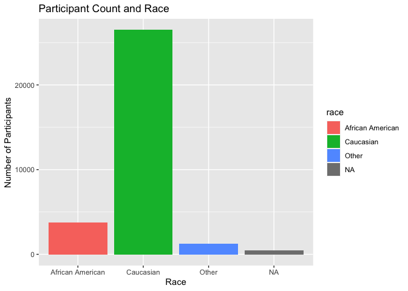
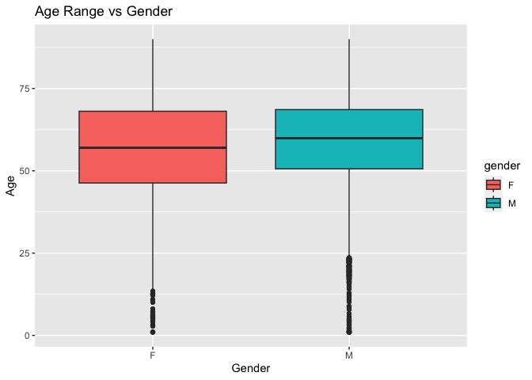
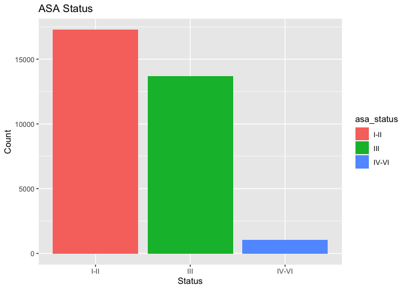
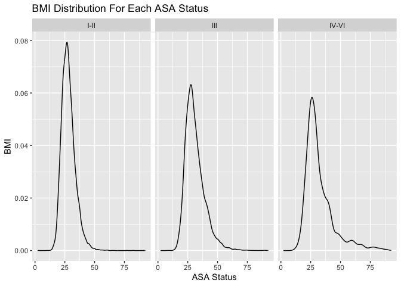
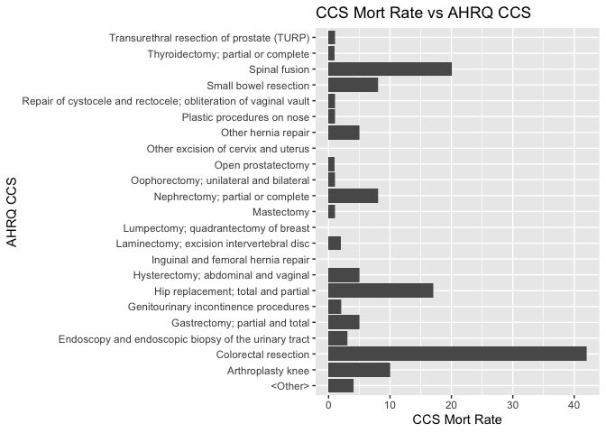
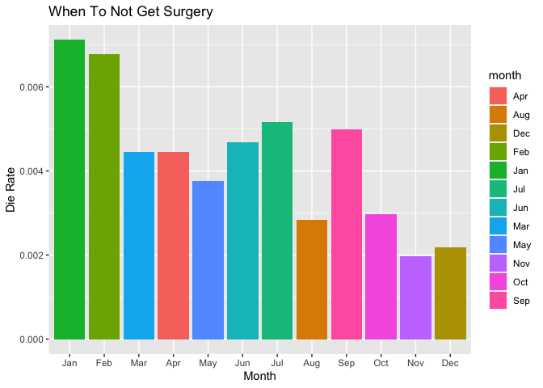
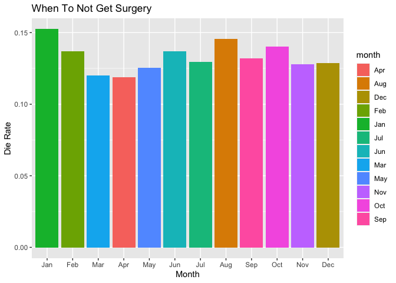

## Instructions
Answer the following questions and complete the exercises in RMarkdown. Please embed all of your code and push your final work to your repository. Your code should be organized, clean, and run free from errors. Remember, you must remove the `#` for any included code chunks to run. Be sure to add your name to the author header above.  

After the first 50 minutes, please upload your code (5 points). During the second 50 minutes, you may get help from each other- but no copy/paste. Upload the last version at the end of this time, but be sure to indicate it as final. If you finish early, you are free to leave.

Make sure to use the formatting conventions of RMarkdown to make your report neat and clean! Use the tidyverse and pipes unless otherwise indicated. To receive full credit, all plots must have clearly labeled axes, a title, and consistent aesthetics. This exam is worth a total of 35 points. 

Please load the following libraries.

```r
library("tidyverse")
library("janitor")
library("naniar")
```

## Data
These data are from a study on surgical residents. The study was originally published by Sessier et al. “Operation Timing and 30-Day Mortality After Elective General Surgery”. Anesth Analg 2011; 113: 1423-8. The data were cleaned for instructional use by Amy S. Nowacki, “Surgery Timing Dataset”, TSHS Resources Portal (2016). Available at https://www.causeweb.org/tshs/surgery-timing/.

Descriptions of the variables and the study are included as pdf's in the data folder.  

Please run the following chunk to import the data.

```r
surgery <- read_csv("data/surgery.csv")
```

1. (2 points) Use the summary function(s) of your choice to explore the data and get an idea of its structure. Please also check for NA's.

```r
glimpse(surgery)
```

```
## Rows: 32,001
## Columns: 25
## $ ahrq_ccs            <chr> "<Other>", "<Other>", "<Other>", "<Other>", "<Othe…
## $ age                 <dbl> 67.8, 39.5, 56.5, 71.0, 56.3, 57.7, 56.6, 64.2, 66…
## $ gender              <chr> "M", "F", "F", "M", "M", "F", "M", "F", "M", "F", …
## $ race                <chr> "Caucasian", "Caucasian", "Caucasian", "Caucasian"…
## $ asa_status          <chr> "I-II", "I-II", "I-II", "III", "I-II", "I-II", "IV…
## $ bmi                 <dbl> 28.04, 37.85, 19.56, 32.22, 24.32, 40.30, 64.57, 4…
## $ baseline_cancer     <chr> "No", "No", "No", "No", "Yes", "No", "No", "No", "…
## $ baseline_cvd        <chr> "Yes", "Yes", "No", "Yes", "No", "Yes", "Yes", "Ye…
## $ baseline_dementia   <chr> "No", "No", "No", "No", "No", "No", "No", "No", "N…
## $ baseline_diabetes   <chr> "No", "No", "No", "No", "No", "No", "Yes", "No", "…
## $ baseline_digestive  <chr> "Yes", "No", "No", "No", "No", "No", "No", "No", "…
## $ baseline_osteoart   <chr> "No", "No", "No", "No", "No", "No", "No", "No", "N…
## $ baseline_psych      <chr> "No", "No", "No", "No", "No", "Yes", "No", "No", "…
## $ baseline_pulmonary  <chr> "No", "No", "No", "No", "No", "No", "No", "No", "N…
## $ baseline_charlson   <dbl> 0, 0, 0, 0, 0, 0, 2, 0, 1, 2, 0, 1, 0, 0, 0, 0, 0,…
## $ mortality_rsi       <dbl> -0.63, -0.63, -0.49, -1.38, 0.00, -0.77, -0.36, -0…
## $ complication_rsi    <dbl> -0.26, -0.26, 0.00, -1.15, 0.00, -0.84, -1.34, 0.0…
## $ ccsmort30rate       <dbl> 0.0042508, 0.0042508, 0.0042508, 0.0042508, 0.0042…
## $ ccscomplicationrate <dbl> 0.07226355, 0.07226355, 0.07226355, 0.07226355, 0.…
## $ hour                <dbl> 9.03, 18.48, 7.88, 8.80, 12.20, 7.67, 9.53, 7.52, …
## $ dow                 <chr> "Mon", "Wed", "Fri", "Wed", "Thu", "Thu", "Tue", "…
## $ month               <chr> "Nov", "Sep", "Aug", "Jun", "Aug", "Dec", "Apr", "…
## $ moonphase           <chr> "Full Moon", "New Moon", "Full Moon", "Last Quarte…
## $ mort30              <chr> "No", "No", "No", "No", "No", "No", "No", "No", "N…
## $ complication        <chr> "No", "No", "No", "No", "No", "No", "No", "Yes", "…
```


```r
surgery %>% 
  summarise_all(~(sum(is.na(.)))) #in this data set, NAs are represented as NAs. 
```

```
## # A tibble: 1 × 25
##   ahrq_ccs   age gender  race asa_status   bmi baselin…¹ basel…² basel…³ basel…⁴
##      <int> <int>  <int> <int>      <int> <int>     <int>   <int>   <int>   <int>
## 1        0     2      3   480          8  3290         0       0       0       0
## # … with 15 more variables: baseline_digestive <int>, baseline_osteoart <int>,
## #   baseline_psych <int>, baseline_pulmonary <int>, baseline_charlson <int>,
## #   mortality_rsi <int>, complication_rsi <int>, ccsmort30rate <int>,
## #   ccscomplicationrate <int>, hour <int>, dow <int>, month <int>,
## #   moonphase <int>, mort30 <int>, complication <int>, and abbreviated variable
## #   names ¹​baseline_cancer, ²​baseline_cvd, ³​baseline_dementia,
## #   ⁴​baseline_diabetes
```

```r
miss_var_summary(surgery)
```

```
## # A tibble: 25 × 3
##    variable          n_miss pct_miss
##    <chr>              <int>    <dbl>
##  1 bmi                 3290 10.3    
##  2 race                 480  1.50   
##  3 asa_status             8  0.0250 
##  4 gender                 3  0.00937
##  5 age                    2  0.00625
##  6 ahrq_ccs               0  0      
##  7 baseline_cancer        0  0      
##  8 baseline_cvd           0  0      
##  9 baseline_dementia      0  0      
## 10 baseline_diabetes      0  0      
## # … with 15 more rows
```

```r
surgery
```

```
## # A tibble: 32,001 × 25
##    ahrq_ccs   age gender race      asa_s…¹   bmi basel…² basel…³ basel…⁴ basel…⁵
##    <chr>    <dbl> <chr>  <chr>     <chr>   <dbl> <chr>   <chr>   <chr>   <chr>  
##  1 <Other>   67.8 M      Caucasian I-II     28.0 No      Yes     No      No     
##  2 <Other>   39.5 F      Caucasian I-II     37.8 No      Yes     No      No     
##  3 <Other>   56.5 F      Caucasian I-II     19.6 No      No      No      No     
##  4 <Other>   71   M      Caucasian III      32.2 No      Yes     No      No     
##  5 <Other>   56.3 M      African … I-II     24.3 Yes     No      No      No     
##  6 <Other>   57.7 F      Caucasian I-II     40.3 No      Yes     No      No     
##  7 <Other>   56.6 M      Other     IV-VI    64.6 No      Yes     No      Yes    
##  8 <Other>   64.2 F      Caucasian III      43.2 No      Yes     No      No     
##  9 <Other>   66.2 M      Caucasian III      28.0 No      Yes     No      No     
## 10 <Other>   20.1 F      Caucasian I-II     27.4 Yes     No      No      No     
## # … with 31,991 more rows, 15 more variables: baseline_digestive <chr>,
## #   baseline_osteoart <chr>, baseline_psych <chr>, baseline_pulmonary <chr>,
## #   baseline_charlson <dbl>, mortality_rsi <dbl>, complication_rsi <dbl>,
## #   ccsmort30rate <dbl>, ccscomplicationrate <dbl>, hour <dbl>, dow <chr>,
## #   month <chr>, moonphase <chr>, mort30 <chr>, complication <chr>, and
## #   abbreviated variable names ¹​asa_status, ²​baseline_cancer, ³​baseline_cvd,
## #   ⁴​baseline_dementia, ⁵​baseline_diabetes
```

2. (3 points) Let's explore the participants in the study. Show a count of participants by race AND make a plot that visually represents your output.

```r
colnames(surgery)
```

```
##  [1] "ahrq_ccs"            "age"                 "gender"             
##  [4] "race"                "asa_status"          "bmi"                
##  [7] "baseline_cancer"     "baseline_cvd"        "baseline_dementia"  
## [10] "baseline_diabetes"   "baseline_digestive"  "baseline_osteoart"  
## [13] "baseline_psych"      "baseline_pulmonary"  "baseline_charlson"  
## [16] "mortality_rsi"       "complication_rsi"    "ccsmort30rate"      
## [19] "ccscomplicationrate" "hour"                "dow"                
## [22] "month"               "moonphase"           "mort30"             
## [25] "complication"
```


```r
surgery %>% 
  count(race) %>% 
  ggplot(aes(x= race, y= n, fill=race))+
  geom_col()+
  labs(title= "Participant Count and Race", 
       x= "Race",
       y= "Number of Participants")
```

<!-- -->


3. (2 points) What is the mean age of participants by gender? (hint: please provide a number for each) Since only three participants do not have gender indicated, remove these participants from the data.

```r
surgery %>% 
  select(gender, age) %>% 
  group_by(gender) %>%
  filter(gender == "M") %>% 
  summarize(mean_m = mean(age, na.rm=T))
```

```
## # A tibble: 1 × 2
##   gender mean_m
##   <chr>   <dbl>
## 1 M        58.8
```

```r
surgery %>% 
  select(gender, age) %>% 
  group_by(gender) %>%
  filter(gender == "F") %>% 
  summarize(mean_f = mean(age, na.rm=T))
```

```
## # A tibble: 1 × 2
##   gender mean_f
##   <chr>   <dbl>
## 1 F        56.7
```


4. (3 points) Make a plot that shows the range of age associated with gender.

```r
surgery %>% 
    filter(gender != "NA") %>% 
  ggplot(aes(x= gender, y= age, fill= gender))+ 
  geom_boxplot()+
  labs(title= "Age Range vs Gender", 
       x= "Gender",
       y= "Age")
```

```
## Warning: Removed 2 rows containing non-finite values (`stat_boxplot()`).
```

<!-- -->


5. (2 points) How healthy are the participants? The variable `asa_status` is an evaluation of patient physical status prior to surgery. Lower numbers indicate fewer comorbidities (presence of two or more diseases or medical conditions in a patient). Make a plot that compares the number of `asa_status` I-II, III, and IV-V.

```r
colnames(surgery)
```

```
##  [1] "ahrq_ccs"            "age"                 "gender"             
##  [4] "race"                "asa_status"          "bmi"                
##  [7] "baseline_cancer"     "baseline_cvd"        "baseline_dementia"  
## [10] "baseline_diabetes"   "baseline_digestive"  "baseline_osteoart"  
## [13] "baseline_psych"      "baseline_pulmonary"  "baseline_charlson"  
## [16] "mortality_rsi"       "complication_rsi"    "ccsmort30rate"      
## [19] "ccscomplicationrate" "hour"                "dow"                
## [22] "month"               "moonphase"           "mort30"             
## [25] "complication"
```

```r
surgery
```

```
## # A tibble: 32,001 × 25
##    ahrq_ccs   age gender race      asa_s…¹   bmi basel…² basel…³ basel…⁴ basel…⁵
##    <chr>    <dbl> <chr>  <chr>     <chr>   <dbl> <chr>   <chr>   <chr>   <chr>  
##  1 <Other>   67.8 M      Caucasian I-II     28.0 No      Yes     No      No     
##  2 <Other>   39.5 F      Caucasian I-II     37.8 No      Yes     No      No     
##  3 <Other>   56.5 F      Caucasian I-II     19.6 No      No      No      No     
##  4 <Other>   71   M      Caucasian III      32.2 No      Yes     No      No     
##  5 <Other>   56.3 M      African … I-II     24.3 Yes     No      No      No     
##  6 <Other>   57.7 F      Caucasian I-II     40.3 No      Yes     No      No     
##  7 <Other>   56.6 M      Other     IV-VI    64.6 No      Yes     No      Yes    
##  8 <Other>   64.2 F      Caucasian III      43.2 No      Yes     No      No     
##  9 <Other>   66.2 M      Caucasian III      28.0 No      Yes     No      No     
## 10 <Other>   20.1 F      Caucasian I-II     27.4 Yes     No      No      No     
## # … with 31,991 more rows, 15 more variables: baseline_digestive <chr>,
## #   baseline_osteoart <chr>, baseline_psych <chr>, baseline_pulmonary <chr>,
## #   baseline_charlson <dbl>, mortality_rsi <dbl>, complication_rsi <dbl>,
## #   ccsmort30rate <dbl>, ccscomplicationrate <dbl>, hour <dbl>, dow <chr>,
## #   month <chr>, moonphase <chr>, mort30 <chr>, complication <chr>, and
## #   abbreviated variable names ¹​asa_status, ²​baseline_cancer, ³​baseline_cvd,
## #   ⁴​baseline_dementia, ⁵​baseline_diabetes
```


```r
surgery %>% 
  filter(asa_status != "NA") %>% 
ggplot(aes(x= asa_status, fill= asa_status)) +
  geom_bar(position= "dodge")+
  labs(title = "ASA Status",
       x= "Status",
       y= "Count") #the participants are relatively healthy with the majority having few comorbidities
```

<!-- -->

6. (3 points) Create a plot that displays the distribution of body mass index for each `asa_status` as a probability distribution- not a histogram. (hint: use faceting!)

```r
surgery %>% 
    filter(asa_status != "NA") %>% 
  ggplot(aes(x= bmi))+
  geom_density(na.rm = T)+
  facet_wrap(~asa_status)+
  labs(title = "BMI Distribution For Each ASA Status", 
       x= "ASA Status",
       y= "BMI")
```

<!-- -->


The variable `ccsmort30rate` is a measure of the overall 30-day mortality rate associated with each type of operation. The variable `ccscomplicationrate` is a measure of the 30-day in-hospital complication rate. The variable `ahrq_ccs` lists each type of operation.  

7. (4 points) What are the 5 procedures associated with highest risk of 30-day mortality AND how do they compare with the 5 procedures with highest risk of complication? (hint: no need for a plot here)

```r
colnames(surgery)
```

```
##  [1] "ahrq_ccs"            "age"                 "gender"             
##  [4] "race"                "asa_status"          "bmi"                
##  [7] "baseline_cancer"     "baseline_cvd"        "baseline_dementia"  
## [10] "baseline_diabetes"   "baseline_digestive"  "baseline_osteoart"  
## [13] "baseline_psych"      "baseline_pulmonary"  "baseline_charlson"  
## [16] "mortality_rsi"       "complication_rsi"    "ccsmort30rate"      
## [19] "ccscomplicationrate" "hour"                "dow"                
## [22] "month"               "moonphase"           "mort30"             
## [25] "complication"
```


```r
surgery %>% 
  group_by(ahrq_ccs) %>% 
  summarize("avg_mort"= mean(ccsmort30rate)) %>% 
  slice_max(avg_mort,n=5)
```

```
## # A tibble: 5 × 2
##   ahrq_ccs                                             avg_mort
##   <chr>                                                   <dbl>
## 1 Colorectal resection                                  0.0167 
## 2 Small bowel resection                                 0.0129 
## 3 Gastrectomy; partial and total                        0.0127 
## 4 Endoscopy and endoscopic biopsy of the urinary tract  0.00811
## 5 Spinal fusion                                         0.00742
```

```r
surgery %>% 
  group_by(ahrq_ccs) %>% 
  summarize("avg_compl" = mean(ccscomplicationrate)) %>% 
  slice_max(avg_compl,n=5)
```

```
## # A tibble: 5 × 2
##   ahrq_ccs                         avg_compl
##   <chr>                                <dbl>
## 1 Small bowel resection                0.466
## 2 Colorectal resection                 0.312
## 3 Nephrectomy; partial or complete     0.197
## 4 Gastrectomy; partial and total       0.190
## 5 Spinal fusion                        0.183
```


8. (3 points) Make a plot that compares the `ccsmort30rate` for all listed `ahrq_ccs` procedures.

```r
surgery %>% 
  ggplot(aes(x= ahrq_ccs, y=ccsmort30rate))+
  geom_col()+
  coord_flip()+
  labs(title = "CCS Mort Rate vs AHRQ CCS",
       x= "AHRQ CCS",
       y= "CCS Mort Rate")
```

<!-- -->


9. (4 points) When is the best month to have surgery? Make a chart that shows the 30-day mortality and complications for the patients by month. `mort30` is the variable that shows whether or not a patient survived 30 days post-operation.

```r
colnames(surgery)
```

```
##  [1] "ahrq_ccs"            "age"                 "gender"             
##  [4] "race"                "asa_status"          "bmi"                
##  [7] "baseline_cancer"     "baseline_cvd"        "baseline_dementia"  
## [10] "baseline_diabetes"   "baseline_digestive"  "baseline_osteoart"  
## [13] "baseline_psych"      "baseline_pulmonary"  "baseline_charlson"  
## [16] "mortality_rsi"       "complication_rsi"    "ccsmort30rate"      
## [19] "ccscomplicationrate" "hour"                "dow"                
## [22] "month"               "moonphase"           "mort30"             
## [25] "complication"
```


```r
surgery %>% 
  select(month,mort30) %>% 
  mutate("count_mort" = as.factor(mort30)) %>% 
  group_by(month) %>% 
  count(count_mort) %>% 
  pivot_wider(names_from= count_mort,
               values_from= n) %>% 
  mutate(die_rate = (Yes / (No + Yes))) %>% 
  arrange(desc(die_rate)) 
```

```
## # A tibble: 12 × 4
## # Groups:   month [12]
##    month    No   Yes die_rate
##    <chr> <int> <int>    <dbl>
##  1 Jan    2651    19  0.00712
##  2 Feb    2489    17  0.00678
##  3 Jul    2313    12  0.00516
##  4 Sep    3192    16  0.00499
##  5 Jun    2980    14  0.00468
##  6 Mar    2685    12  0.00445
##  7 Apr    2686    12  0.00445
##  8 May    2644    10  0.00377
##  9 Oct    2681     8  0.00298
## 10 Aug    3168     9  0.00283
## 11 Dec    1835     4  0.00218
## 12 Nov    2539     5  0.00197
```

```r
surgery %>% 
  select(month,complication) %>% 
  mutate("count_compl" = as.factor(complication)) %>% 
  group_by(month) %>% 
  count(count_compl) %>% 
  pivot_wider(names_from= count_compl,
               values_from= n) %>% 
  mutate(die_rate = (Yes / (No + Yes))) %>% 
  arrange(desc(die_rate))
```

```
## # A tibble: 12 × 4
## # Groups:   month [12]
##    month    No   Yes die_rate
##    <chr> <int> <int>    <dbl>
##  1 Jan    2263   407    0.152
##  2 Aug    2715   462    0.145
##  3 Oct    2312   377    0.140
##  4 Jun    2584   410    0.137
##  5 Feb    2163   343    0.137
##  6 Sep    2784   424    0.132
##  7 Jul    2024   301    0.129
##  8 Dec    1602   237    0.129
##  9 Nov    2219   325    0.128
## 10 May    2321   333    0.125
## 11 Mar    2373   324    0.120
## 12 Apr    2377   321    0.119
```


10. (4 points) Make a plot that visualizes the chart from question #9. Make sure that the months are on the x-axis. Do a search online and figure out how to order the months Jan-Dec.

```r
surgery %>% 
  select(month,mort30) %>% 
  mutate("count_mort" = as.factor(mort30)) %>% 
  group_by(month) %>% 
  count(count_mort) %>% 
  pivot_wider(names_from= count_mort,
               values_from= n) %>% 
  mutate(die_rate = (Yes / (No + Yes))) %>% 
  arrange(desc(die_rate)) %>% 
  ggplot(aes(x= month, y= die_rate, fill= month))+
  geom_col()+
  scale_x_discrete(limits=month.abb)+
  labs(title= "When To Not Get Surgery",
       x= "Month",
       y= "Die Rate")
```

<!-- -->

```r
surgery %>% 
  select(month,complication) %>% 
  mutate("count_compl" = as.factor(complication)) %>% 
  group_by(month) %>% 
  count(count_compl) %>% 
  pivot_wider(names_from= count_compl,
               values_from= n) %>% 
  mutate(die_rate = (Yes / (No + Yes))) %>% 
  arrange(desc(die_rate)) %>% 
  ggplot(aes(x= month, y= die_rate, fill= month))+
  geom_col()+
  scale_x_discrete(limits=month.abb)+
  labs(title= "When To Not Get Surgery",
       x= "Month",
       y= "Die Rate")
```

<!-- -->


Please provide the names of the students you have worked with with during the exam:
Tim and Jacob
Please be 100% sure your exam is saved, knitted, and pushed to your github repository. No need to submit a link on canvas, we will find your exam in your repository.
